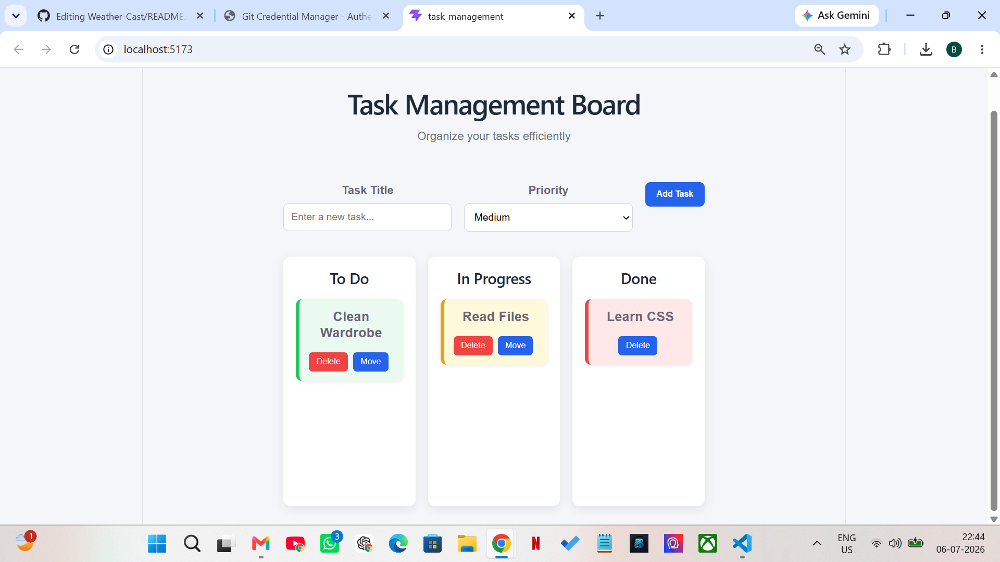
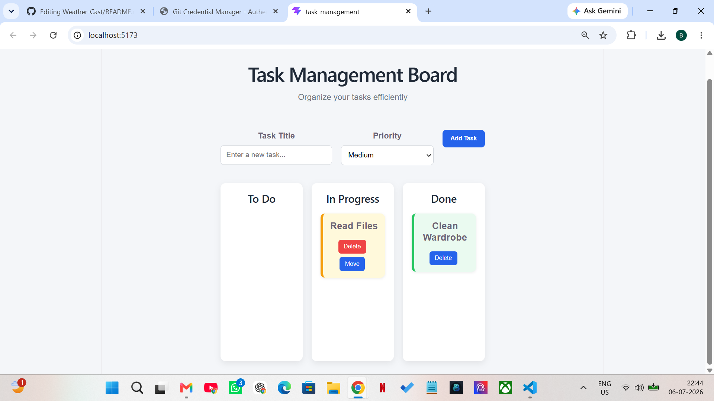

#  Task Management Board

## Overview
A responsive Trello-style Task Management Board built using React and Vite. Users can add, edit, move, and delete tasks while all data is stored in the browser using localStorage.

## Features
- Add new tasks
- Edit task titles
- Delete tasks
- Move tasks between To Do, In Progress, and Done
- Priority-based task colors (High, Medium, Low)
- Data persistence with localStorage
- Responsive design for desktop and mobile

##  Tech Stack
- React
- Vite
- JavaScript (ES6+)
- CSS3
- HTML5

##  Screenshots

